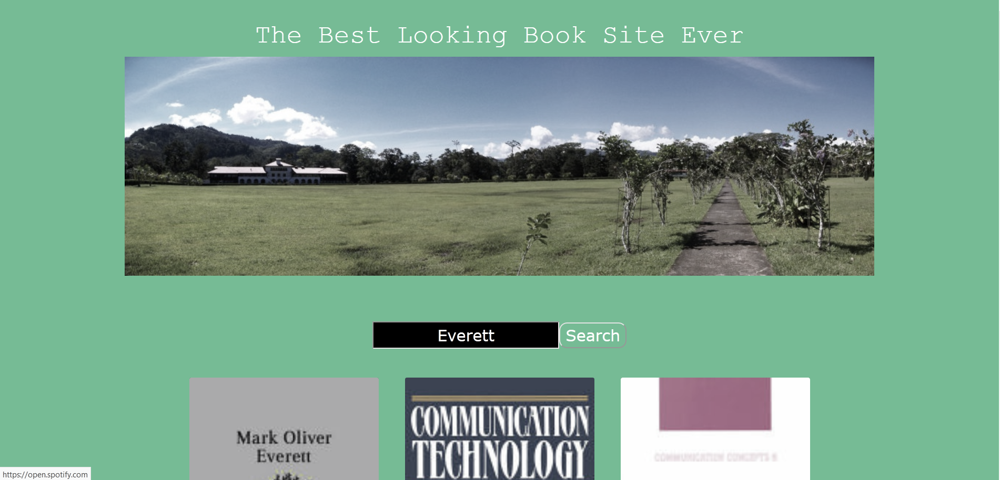

# Google Books Search

Build a book search app using React.

Production page: https://frozen-sierra-44464.herokuapp.com/

## This repo contains:
* This README
* A Full-Stack Web app to search for books 

## Known Issues / Bugs
* None currently.

## What I Learned:
* Using React is tough when starting up a project. As the project scales, you start to see the benefits of not having to reuse code while nurturing forward-thinking concepts during the developent process.

## Conclusion:
* The styling could definitely use some work.
